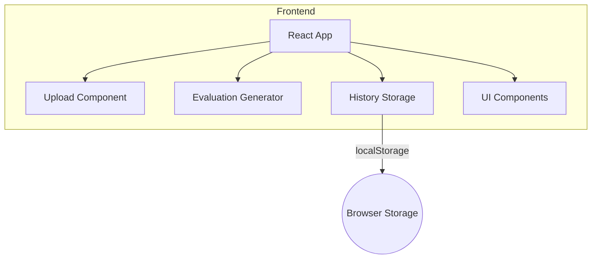
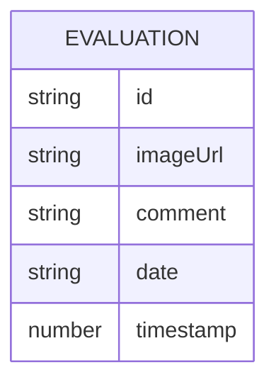

## 1. Architecture Design
本系统采用纯前端架构，所有功能在浏览器端完成，无需后端服务。



## 2. Technology Description
- **Frontend**: React@18 + TypeScript + tailwindcss@3 + vite
- **Initialization Tool**: vite-init
- **Backend**: None (纯前端实现)
- **Database**: localStorage (浏览器本地存储)
- **图像分析**: 简单的构图规则引擎（前端实现）

## 3. Route Definitions
| Route | Purpose |
|-------|---------|
| / | 首页，上传图片和显示历史评价 |
| /detail/:id | 评价详情页，查看大图和完整评价 |

## 4. API Definitions
本系统无需后端API，所有功能在前端实现。

## 5. Server Architecture Diagram
本系统无需后端服务。

## 6. Data Model
### 6.1 Data Model Definition



### 6.2 Data Structure
```typescript
interface Evaluation {
  id: string;
  imageUrl: string; // base64 encoded image
  comment: string;
  date: string; // YYYY-MM-DD format
  timestamp: number;
}
```

### 6.3 Storage Strategy
使用localStorage存储评价历史，键名为`imageEvaluations`，值为JSON序列化的`Evaluation[]`数组。
