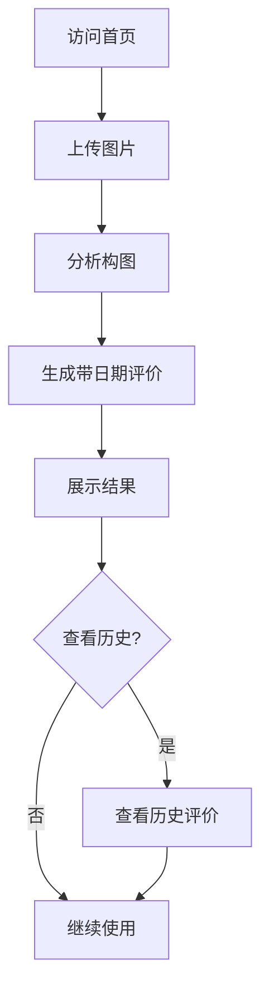

## 1. Product Overview
图片评价系统，用户可上传图片并获得基于构图的自动评价，支持日期标注的短评价（50字内）。
- 解决图片构图评价效率低的问题，为摄影爱好者、设计师提供快速反馈
- 降低专业评价门槛，让普通用户也能获得有用的构图建议

## 2. Core Features

### 2.1 User Roles
本系统无需用户注册，所有功能面向访客开放。

### 2.2 Feature Module
1. **首页**：图片上传区域、历史评价展示
2. **评价详情**：查看图片及对应评价

### 2.3 Page Details
| Page Name | Module Name | Feature description |
|-----------|-------------|---------------------|
| 首页 | 图片上传 | 支持拖拽或点击上传图片文件，支持常见图片格式 |
| 首页 | 评价生成 | 上传完成后自动生成带日期的构图评价（50字内） |
| 首页 | 历史评价 | 展示最近生成的图片评价列表，可查看详情 |
| 评价详情 | 详情展示 | 大图预览、完整评价内容展示 |

## 3. Core Process
用户访问首页 → 上传图片 → 系统分析构图 → 生成带日期的评价 → 展示结果 → 可选查看历史评价

## 4. User Interface Design
### 4.1 Design Style
- **主色调**：深蓝色(#1e3a8a)和天蓝色(#3b82f6)
- **按钮样式**：圆角矩形，带有轻微阴影和悬停动画
- **字体**：使用Google Fonts的"Poppins"和"Noto Sans SC"组合
- **布局风格**：卡片式布局，居中对齐，留有充足留白
- **图标风格**：简洁的线性图标

### 4.2 Page Design Overview
| Page Name | Module Name | UI Elements |
|-----------|-------------|-------------|
| 首页 | 上传区域 | 虚线边框的拖放区，带有上传图标和提示文字 |
| 首页 | 评价展示 | 卡片式布局，图片缩略图+评价文本+日期 |
| 首页 | 历史列表 | 网格布局，每个评价一个卡片 |
| 评价详情 | 详情页 | 全屏大图预览，评价文本位于下方 |

### 4.3 Responsiveness
桌面端优先设计，自适应平板和移动端，触控优化上传按钮。

### 4.4 3D Scene Guidance
本项目不需要3D场景。
